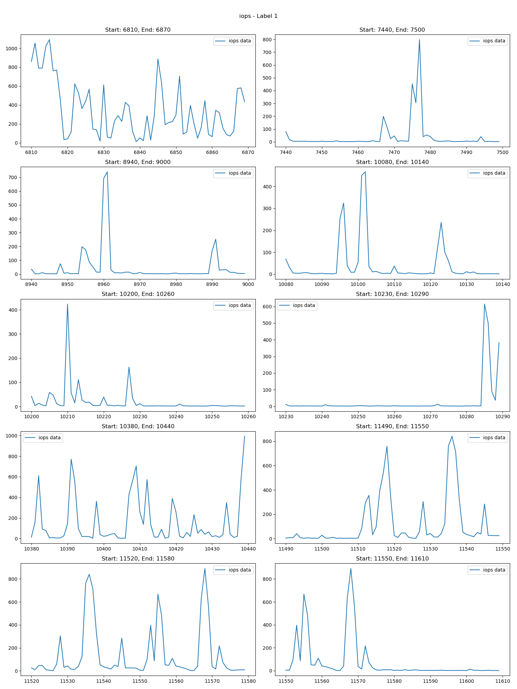
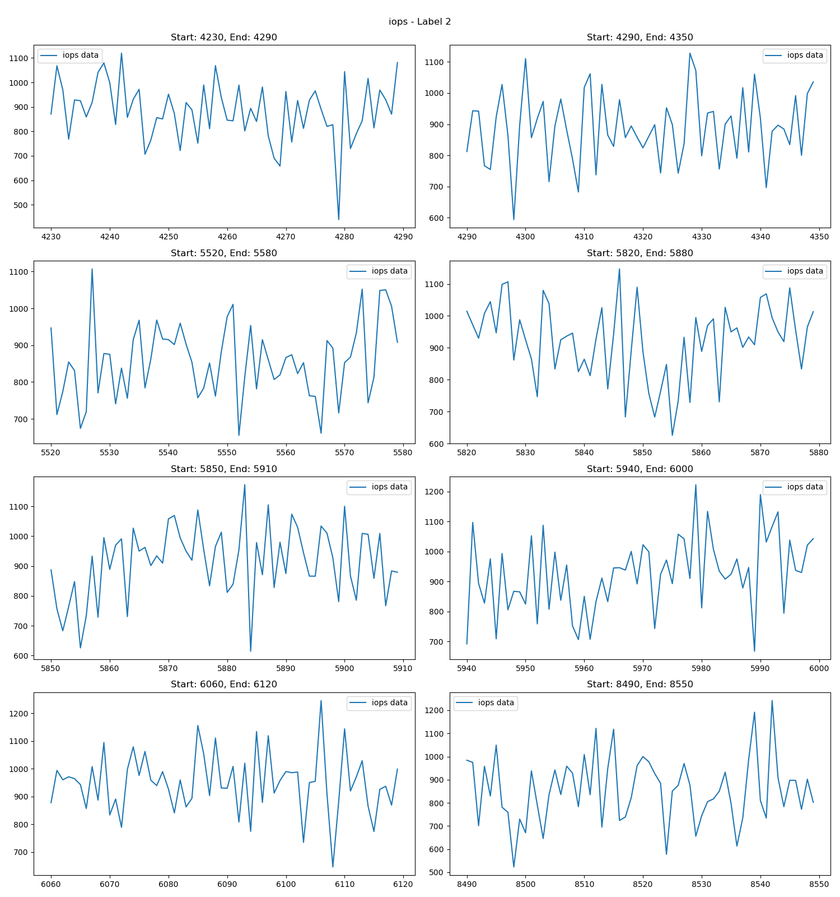

# drift-detection-OSRE24

## Overview
Drift, including both data drift and concept drift will affect the model's performance over time.  This project focuses specifically on data drift (feature drift), aiming to design a pipeline for evaluating drift detection algorithms on system traces. The project is divided into two main parts: dataset construction and algorithm benchmarking.

<p align="center">
  
  
  <p align="center"><sub>a) Left: timestamps where drift happens b) Right: timestamps where no drift happens</sub></p>
</p>

**[PART 1: Dataset Construction]**
I constructed a data drift dataset using the Tencent I/O block trace, which includes both drift and non-drift labels. The raw traces were processed into timestamps with various features. To detect where drift happens and construct the datasets, I employed several offline drift detection algorithms, including Kolmogorov-Smirnov, Cramer-von Mises, KL-Divergence, and Jensen-Shannon Distance. A voting strategy, along with post-processing techniques, was applied to build and clean the datasets. Given that trace data often contains noise, which can affect the accuracy of drift detection, additional preprocessing steps such as fourier transform and moving average were taken to mitigate this issue.

**[PART 2: Benchmark Drift Detection Algorithms]**
This part focuses on benchmarking the Jensen-Shannon and Wasserstein drift detection methods using system trace data. The evaluation metrics are categorized into three main areas:

1. Detection Accuracy Metrics
- True Positive Rate (Recall)
- True Negative Rate (Specificity)
- Precision
- F1-Score
2. Detection Overhead Metrics
- Time Taken: The computational time required to detect drifts, critical 
3. Stability Metrics
- False Positive Rate
- False Negative Rate 

(Additional) Comparative Analysis:
- Accuracy Across Different Features: How well the detection algorithms perform when applied to various features within the system trace data.


For more specific details about the project such as visualizations and experimental results, please refer to the final blog attached at the end of this page.


## Project Structure

```bash
project-root/
│
├── config/
│   ├── config.yaml            # configuration for dataset construction
│
├── drifts/                    # implementation of dataset construction code and 
│
├── online-drift-detection-benchmark/   # benchmark online drift detection notebooks
│   ├── Jensen-Shannon_distance.ipynb 
│   ├── wasserstein_distance.ipynb 
│
├── output/                    # labeled dataset output
│   ├── 1063_1m_winlen_60_stepsize_30_none
│   ├── ...
│
├── generate_dataset.py        # run this script to generate labeled dataset
```

## Getting Started

To generate labeled dataset, please following the steps below:
1. configure the setting `config/config.yaml`
2. run `python generate_dataset.py`


## Links
**[Trovi Artifact]** https://chameleoncloud.org/experiment/share/384ee2bd-853c-427b-877b-3af2993fb502

**[Final Blog]**